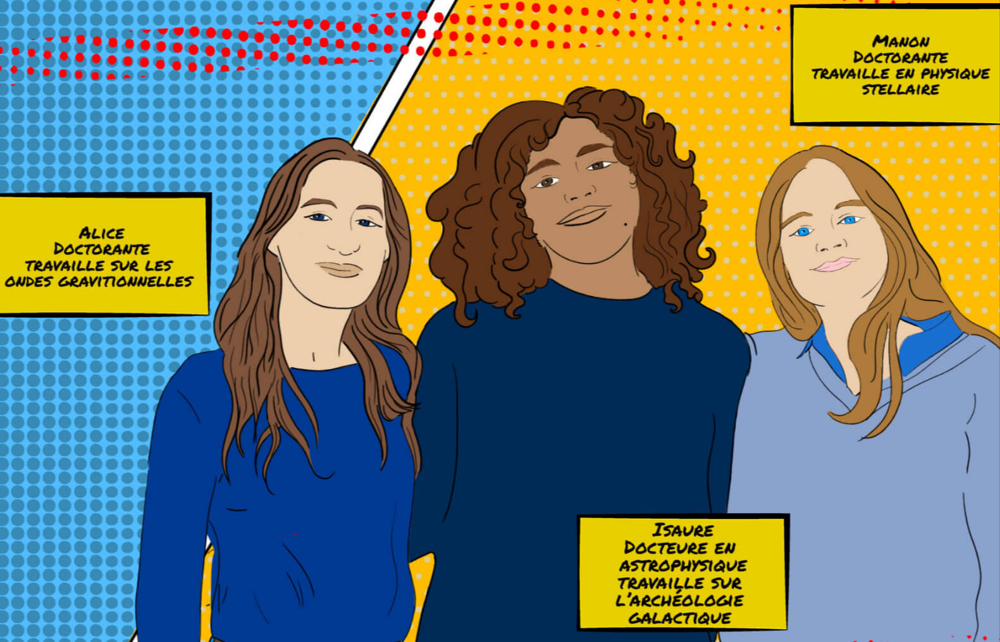
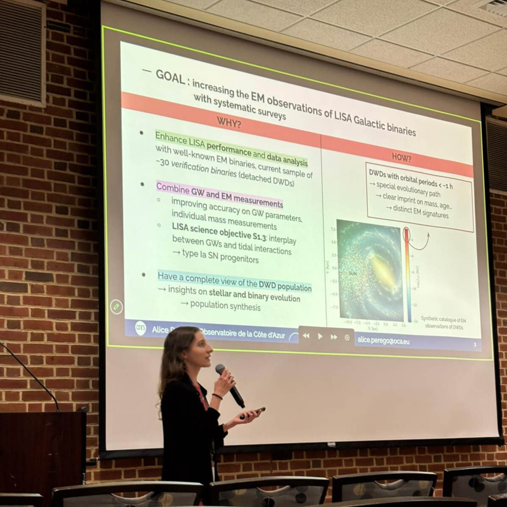
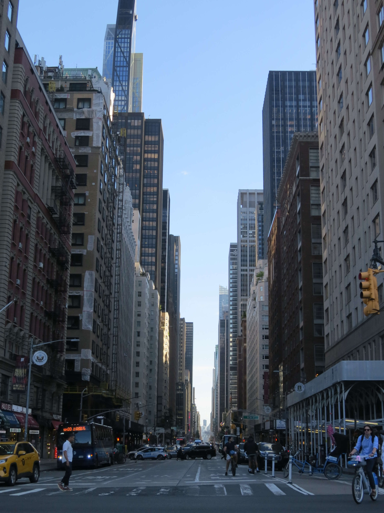
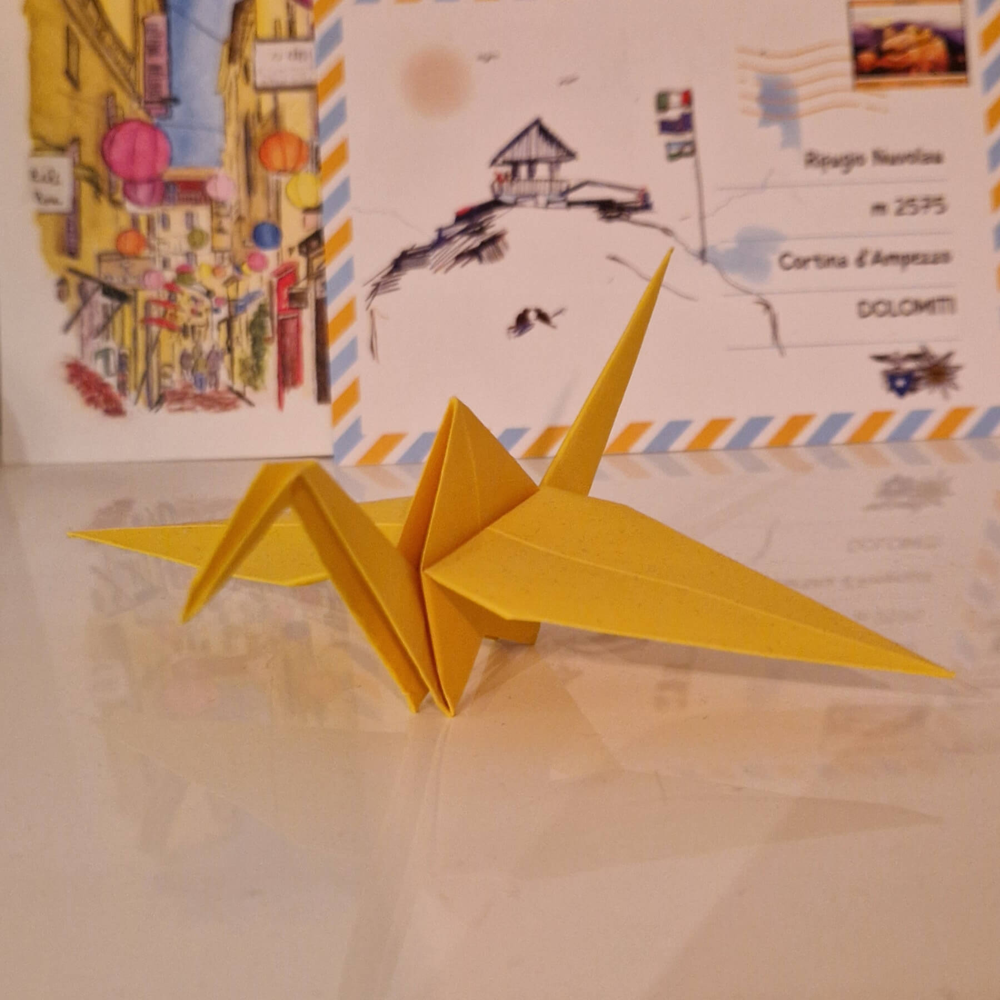
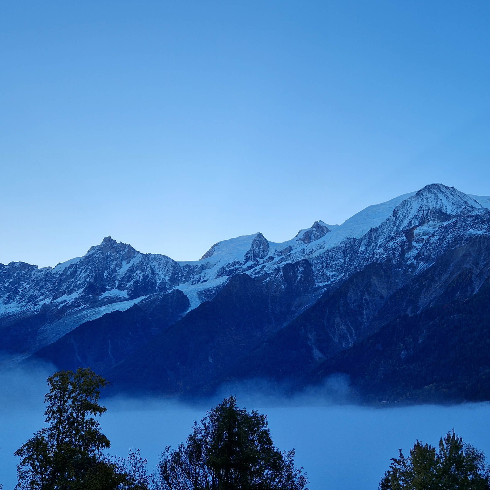
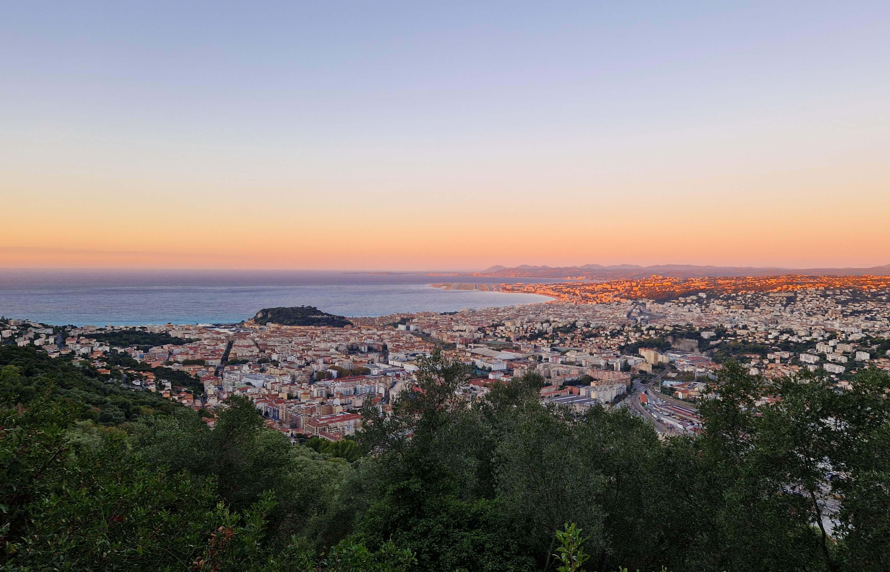

## In a nutshell {.spotlight image="assets/photo.jpg" alt="Portrait of Alice Perego"}

*Welcome! I am a 2nd-year Ph.D. student in the ARTEMIS group at the Observatoire de la Côte d'Azur in Nice, France. My research focuses on gravitational-wave astrophysics with space-based detectors (LISA), ranging from double white dwarfs in the Milky Way to massive black hole binaries and astrophysical backgrounds. I also study multi-messenger synergies for LISA Galactic binaries with electromagnetic observations. *

- ARTEMIS research group -- Observatoire de la Côte d'Azur (OCA)
- Université Côte d'Azur, CNRS
- Supervisors: Nelson Christensen, Astrid Lamberts
- Thesis: *Future perspectives on gravitational-wave astrophysics with space-based detectors: enabling multi-messenger studies of Galactic binaries*

::: tags
- LISA mission
- Ultra-compact double white dwarfs
- Multi-messenger astrophysics
- Photometric and spectroscopic surveys
- Gravitational wave backgrounds
- Massive black hole binaries
:::

## Get in touch {.special}

*I expect to finish my Ph.D in Fall 2027 and I am starting to explore postdoc opportunities in gravitational-wave and multi-messenger astrophysics. Feel free to reach out if you'd like to collaborate or discuss potential roles!*

[Email](mailto:){.button .primary} [CV](){.button} [LinkedIn](){.button}

## Research

::: two-columns

### Ultra-compact double white dwarfs

*Within the billions of white dwarfs (WDs) populating the Milky Way, ultra-compact binaries (orbital periods below one hour) offer a unique window on binary evolution, stellar physics and Type Ia Supernova progenitors, while also being a prime target for the upcoming GW detector LISA. My work focuses on bridging LISA detections with electromagnetic observations: I developed a methodology to identify LISA candidates in multiband photometric surveys, based on specific colour features. At present, I am working on simulated LISA and EM catalogues to optimise the cross-matching of multi-messenger systems. My work actively contributes to observational strategies, including an ESO proposal for P118 and a large-scale survey proposal with the Canada France Hawaii Telescope (CFHT).*

### Astrophysical gravitational-wave backgrounds

*In addition to individual sources, space-based GW detectors can observe a cumulative gravitational-wave background (GWB) generated by a multitude of unresolved systems from the bulk of astrophysical populations. My work involves modelling this signal from micro-Hertz to deci-Hertz frequencies: I developed a unified framework to perform a self-consistent computation of the astrophysical GWBs generated by a broad set of populations, such as massive black hole binaries, extreme mass-ratio inspirals and stellar-mass binaries.*

*Properly characterizing their amplitude is crucial to correctly quantify the impact on the detector sensitivity and individual source parameter estimation, for LISA and future GW detectors. These results also have direct applications in evaluating the detection of cosmological GWBs.*

:::

## Proposals

### ‘Apapane: Dynamic Sky Across All Scales

#### PIs : Viraja Khatu, Alice Perego, Damya Souami

*This collaborative proposal has been submitted to the Canada France Hawaii Telescope (CFHT) in the context of the scheduled Community Survey, spanning a 6-year period from 2027B to 2033A and offering [400-700] nights for its wide-field optical imager MegaCam. It is organised in 3 working packages centred around core questions in astronomy.*

*The primary objective of our working package is to initiate a complete and systematic search for EM counterparts of ultra-compact white dwarf binaries (DWDs) in the Northern sky, in preparation for the LISA mission. Taking advantage of the u-band sensitivity of MegaCam, we propose a deep survey of the Galactic plane in u,g,r filters, requiring an observing time ranging from 70 to 200 nights. This effort will yield nearly 10,000 observations of candidate systems, selected by their colours and to be confirmed by subsequent follow-up observations. This can increase the current sample of DWDs as LISA multi-messenger sources by an order of magnitude, maximizing the mission operations and scientific output. Furthermore, by delivering calibrated u, g, and r photometry across all covered fields down to an unprecedented depth ($u$ ~ 24/24.5), the survey will produce a legacy dataset informing stellar evolution, binary interaction, Galactic structure, and population synthesis studies.*

*Selection results are expected in October 2026.*

### Spectroscopic follow-up of double white dwarf candidates

#### PI: Alice Perego

*This proposal has been submitted in response to ESO Call for Proposal for Period 118.*

*We will employ UVES to obtain high-resolution spectroscopy of 52 targets from Gaia DR3, pre-filtered through a colour criteria that selects the most promising candidates for compact systems. This will allow to increase the catalogue of electromagnetic counterparts for LISA, extending into unexplored faint magnitudes and refining the strategy for future surveys, while also yielding a valuable dataset for the broader white dwarf community.*

## Tools I work with

* **`COSMIC`** | **Binary Population Synthesis**  
  Rapid suite for generating compact binary populations.

* **`LISA Analysis Tools` & `GBGPU`** | **Galactic Binaries**  
  LISA Data analysis pipelines for Galactic binary systems.

* **`lisabeta`** | **Massive Black Hole Binaries**  
  LISA parameter estimation for massive black hole binaries.

* **`extrapops`** | **Extra-galactic GW Sources**  
  Population synthesis and analysis of stellar-origin binary black holes.

* **`GWpop_tools`** | **SNR and GWB calculations** [Private Pipeline]  
  Framework for estimating astrophysical backgrounds and identifying resolved systems across multi-band frequencies (micro-Hz -- deci-Hz).

* **`photocat`** | **WD modelling** [Private Pipeline]  
  Calculates photometric magnitudes of white dwarfs from theoretical cooling and atmospheric models.

## Publications and proceedings



[All publications](publications.qmd){.button .primary} [Proceedings](publications.qmd#proceedings){.button}

## Personal interests

*In my free time, I enjoy reading (mostly fantasy and detective fiction), practicing origami, and wandering around to explore new surroundings. I love traveling and taking endless photos along the way (though sorting them out later is a different story), hiking in the summer and skiing in the winter.*

## Gallery

::: {.gallery-grid}

{.img-landscape alt="BD image"}

{.img-square alt="Conference image"}

{.img-tall alt="New York image"}

{.img-square alt="Origami image"}

{.img-square alt="Snow image"}

{.img-wide-bottom alt="Nice image"}

:::